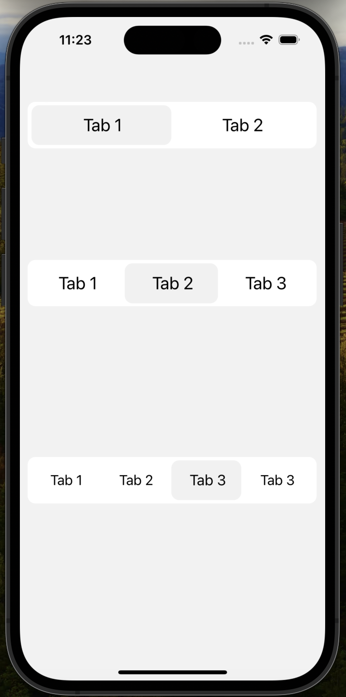
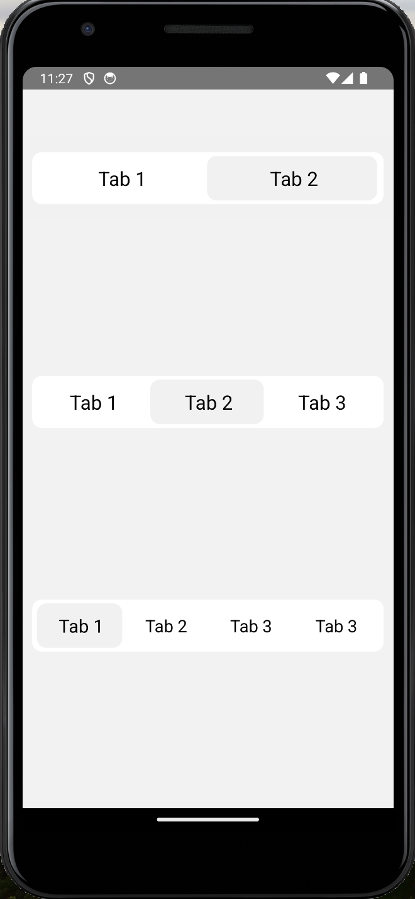

# `react-native-tab-strip`

![Supports iOS and Android][support-badge]![Github Action Badge][gha-badge] ![npm][npm-badge] [![Lean Core Extracted][lean-core-badge]][lean-core-issue]

An animated tab bar component for React Native.

## Getting started

Install the library using your package manager:

pnpm:

```
pnpm install --save react-native-tab-strip
```

yarn:

```
yarn add react-native-tab-strip
```

npm:

```
npm install --save react-native-tab-strip
```

Image Demo
Here's a quick demo of react-native-tab-strip:

| iOS                                 | Android                                 |
| ----------------------------------- | --------------------------------------- |
|  |  |

react-native-tab-strip is a versatile and animated tab bar component designed for React Native applications. It provides an intuitive interface for navigating between tabs with customizable styles and smooth

animations.

Key Features
Animated Tab Bar: Enhance user experience with smooth animations when switching tabs.

Customizable: Tailor the appearance of the tab bar to fit your app's design using various styling options.
Event Handling: Easily manage tab press events with a simple callback function.

Flexible Integration: Integrate seamlessly into new or existing React Native projects.

## Usage Example

```javascript
import AnimatedTabBar from "react-native-tab-strip";
```

## Usage

Start by importing the library:

Use `AnimatedTabBar` to render a Tab bar .

#### Programmatically changing selected index

```javascript
import AnimatedTabBar from "react-native-tab-strip";

return (
  <AnimatedTabBar
    // required
    data={[{ title: "Tab 1" }, { title: "Tab 2" }]}
    // required
    itemWidth={100}
    onItemPress={() => {}}
  />
);
```

Data:

The data prop is an array of objects, and each object must contain a mandatory property named title. This title will be displayed on the tab item.

```javascript
<AnimatedTabBar
  // Required: Array of tab data objects, each containing a 'title' property
  data={data}
  // Callback function invoked when a tab is pressed (Optional)
  onTabPress={(item, index) => {
    console.log(`Pressed tab ${index + 1}: ${item} `);
  }}
  // Width of each tab item (Required)
  itemWidth={170}
  // Background color of the tab bar (Optional)
  tabBarBackground="#ffff"
  // Color of the active tab item (Optional)
  tabBarActiveItemColor="#f1f1f1"
  // Color of inactive tab items (Optional)
  tabBarInactiveItemColor="white"
  // Text color of active tab items (Optional)
  tabBarActiveTxtColor="black"
  // Text color of inactive tab items (Optional)
  tabBarInactiveTxtColor="black"
  // Main container style of the tab bar (Optional)
  mainScrollContainerStyle={{}}
  // Optional styles for the main container of the top bar
  containerStyle={{}}
  // Optional styles for the selected item container
  selectedItemContainerStyle={{}}
  // Optional styles for each tab item container
  itemContainerStyle={{}}
  // Optional text style for the selected tab item
  selectedTxtStyle={{}}
  // Optional text style for each tab item
  txtStyle={{}}
/>
```

Use code with caution.

Available Props

### `data`

Array of objects defining each tab. Each object must have a `title` property (string).

| Type     | Required |
| -------- | -------- |
| object[] | Yes      |

---

### `itemWidth`

Width of each tab item.

| Type   | Required |
| ------ | -------- |
| number | Yes      |

---

### `onTabPress`

Callback function invoked when a tab is pressed. Receives the pressed tab data object and its index (zero-based) as arguments.

| Type     | Required |
| -------- | -------- |
| function | No       |

---

### `tabBarBackground`

Background color of the tab bar.

| Type   | Required |
| ------ | -------- |
| string | No       |

---

### `tabBarActiveItemColor`

Color of the active tab item.

| Type   | Required |
| ------ | -------- |
| string | No       |

---

### `tabBarInactiveItemColor`

Color of inactive tab items.

| Type   | Required |
| ------ | -------- |
| string | No       |

---

### `tabBarActiveTxtColor`

Text color of active tab items.

| Type   | Required |
| ------ | -------- |
| string | No       |

---

### `tabBarInactiveTxtColor`

Text color of inactive tab items.

| Type   | Required |
| ------ | -------- |
| string | No       |

---

### `mainScrollContainerStyle`

Style object applied to the main container of the tab bar.

| Type   | Required |
| ------ | -------- |
| object | No       |

---

### `containerStyle`

Style object applied to the container of the selected tab item.

| Type   | Required |
| ------ | -------- |
| object | No       |

---

### `selectedItemContainerStyle`

Style object applied to the container of each tab item.

| Type   | Required |
| ------ | -------- |
| object | No       |

---

### `itemContainerStyle`

Style object applied to the text element of each tab item.

| Type   | Required |
| ------ | -------- |
| object | No       |

---

### `selectedTxtStyle`

Style object applied to the text element of the selected tab item.

| Type   | Required |
| ------ | -------- |
| object | No       |

---

### `txtStyle`

Style object applied to the text element of each tab item.

| Type   | Required |
| ------ | -------- |
| object | No       |
